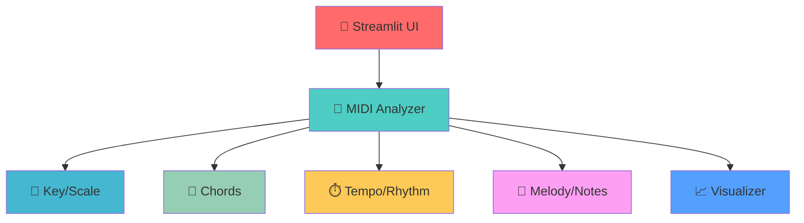

# 🎵 MIDI Maestro - Interactive MIDI Analyzer

<div align="center">


[](#-quick-start-guide)
[](#-quick-start-guide)
[](#-quick-start-guide)

**🚀 Explore MIDI like never before!**

An interactive, emoji-rich analyzer for music creators and learners. Detects 🎼 key, 🎶 scale notes, ⏱️ tempo, 🕒 time signature, 🔗 chords, and more — with beautiful visuals and downloadable data.

[📖 Documentation](#-quick-start-guide) • [🚀 Quick Start](#-quick-start-guide) • [💡 Examples](#-usage-examples) • [🔧 CLI](#-command-line-analysis)

</div>

---

## ✨ What Makes MIDI Maestro Special?

<div align="center">

| 🎯 Feature | 📊 Impact | 🚀 Technology |
|:--|:--:|:--|
| 🔍 Key, Scale, Chords | Music-theory insights | PrettyMIDI, NumPy |
| ⏱️ Tempo & Rhythm | Groove understanding | Onset/beat tracking |
| 🎵 Melody & Range | Lead line characteristics | Pitch interval stats |
| 📊 Visual Analytics | Faster learning | Matplotlib, Seaborn, Plotly |

</div>

### 🎯 Key Features

<div style="display: grid; grid-template-columns: repeat(auto-fit, minmax(300px, 1fr)); gap: 1rem; margin: 1rem 0;">

<div style="background: linear-gradient(135deg, #667eea 0%, #764ba2 100%); padding: 1rem; border-radius: 10px; color: white;">

#### 🎼 Key & Scale Detection
- 🎯 Key and confidence
- 🎶 Scale notes highlight
- 📊 Pitch-class histogram

</div>

<div style="background: linear-gradient(135deg, #f093fb 0%, #f5576c 100%); padding: 1rem; border-radius: 10px; color: white;">

#### ⏱️ Tempo & Rhythm
- 🕒 Time signature
- ⏱️ Initial tempo + changes
- 📈 Note density over time

</div>

<div style="background: linear-gradient(135deg, #4facfe 0%, #00f2fe 100%); padding: 1rem; border-radius: 10px; color: white;">

#### 🔗 Chords & Harmony
- 📐 Windowed chord estimation
- 🧭 Progression timeline
- 🌐 Interactive HTML export

</div>

<div style="background: linear-gradient(135deg, #43e97b 0%, #38f9d7 100%); padding: 1rem; border-radius: 10px; color: white;">

#### 🎵 Melody & Instruments
- 🎚️ Velocity and contour
- 🎹 Instrument usage
- 🎼 Pitch range and intervals

</div>

</div>

---

## 🏗️ Architecture Overview

<div align="center">



</div>

---

## 🚀 Quick Start Guide

### 📋 Prerequisites

<div style="background: #f8f9fa; padding: 1rem; border-radius: 8px; border-left: 4px solid #007bff;">

✅ Python 3.8+  
✅ Modern web browser  
✅ (Optional) Google Chrome for static PNG export of interactive plots

</div>

### 🛠️ Installation

<div style="background: linear-gradient(135deg, #667eea 0%, #764ba2 100%); color: white; padding: 1.5rem; border-radius: 10px; margin: 1rem 0;">

#### 📥 Step 1: Create a virtual environment
```bash
python -m venv .venv
# Windows
.\.venv\Scripts\Activate.ps1
# macOS/Linux
source .venv/bin/activate
```

#### 📦 Step 2: Install dependencies
```bash
pip install -r enhanced_requirements.txt
```

#### 🚀 Step 3: Launch Streamlit UI
```bash
streamlit run streamlit_app.py
# If the default port is busy:
streamlit run streamlit_app.py --server.port 8502
```

</div>

### 🎉 You’re Ready!

<div align="center">

| 🎯 Service | 🌐 URL | 📝 Description |
|:--|:--:|:--|
| 🌐 Web Interface | `http://localhost:8501` | Interactive Streamlit UI |

</div>

---

## 📖 Usage Examples

### 🎨 Web Interface (Streamlit)

<div style="background: #e3f2fd; padding: 1rem; border-radius: 8px; border-left: 4px solid #2196f3;">

1. 📤 Upload a `.mid` file (or use the provided sample)  
2. ▶️ Click “Run Analysis”  
3. 🌈 View bright, emoji-rich summary (Key, Scale, Tempo, Time Signature, Duration, Notes)  
4. 📊 Explore tabs: Key, Chords, Rhythm, Instruments, Melody  
5. 📥 Download CSV/JSON or open interactive HTML

</div>

### 🔧 Command-line Analysis

<div style="display: grid; grid-template-columns: repeat(auto-fit, minmax(400px, 1fr)); gap: 1rem; margin: 1rem 0;">

<div style="background: #f3e5f5; padding: 1rem; border-radius: 8px; border-left: 4px solid #9c27b0;">

#### ▶️ Analyze a file
```bash
python enhanced_midi_analyzer.py --midi Pirates.mid --outdir enhanced_outputs
```

</div>

<div style="background: #e8f5e8; padding: 1rem; border-radius: 8px; border-left: 4px solid #4caf50;">

#### 🌐 Open interactive HTML exports
Open files like `demo_interactive_chords.html` and `demo_3d_piano_roll.html` in your browser.

</div>

</div>

---

## 🔧 Configuration

### 📁 Supported File Formats

<div style="display: grid; grid-template-columns: repeat(auto-fit, minmax(200px, 1fr)); gap: 1rem; margin: 1rem 0;">

<div style="background: linear-gradient(135deg, #667eea 0%, #764ba2 100%); color: white; padding: 1rem; border-radius: 8px; text-align: center;">

**🎼 MIDI Files**  
`.mid`

</div>

<div style="background: linear-gradient(135deg, #f093fb 0%, #f5576c 100%); color: white; padding: 1rem; border-radius: 8px; text-align: center;">

**📊 Data Exports**  
`.csv`, `.json`

</div>

<div style="background: linear-gradient(135deg, #4facfe 0%, #00f2fe 100%); color: white; padding: 1rem; border-radius: 8px; text-align: center;">

**🌐 Interactive**  
`.html` (Plotly)

</div>

</div>

---

## 📁 Outputs

**Images**  
- `key_analysis.png` — pitch-class histogram + scale highlight  
- `chord_analysis.png` — chord progression timeline  
- `rhythm_analysis.png` — tempo over time + density  
- `instrument_analysis.png` — instrument note counts + velocity  
- `melody_analysis.png` — contour + interval histogram  

**Data**  
- `tempo_changes.csv`, `chords.csv`, `note_density.csv`, `pitch_class_histogram.csv`, `melody_notes.csv`  
- `analysis_results.json` — full structured summary  

**Interactive HTML**  
- `demo_interactive_chords.html`, `demo_3d_piano_roll.html`, `demo_sonification.html`

---

## 📊 UI Summary (Example)

- 🎼 Key: C Major  
- 🎯 Confidence: 0.92  
- 🎶 Scale notes: C D E F G A B  
- ⏱️ Tempo: 120.00 BPM  
- 🕒 Time signature: 4/4  
- ⌛ Duration: 148.2 s  
- 🎹 Total notes: 1370

---

## 🧩 Tech Stack

- Python 3.8+  
- Streamlit (UI)  
- PrettyMIDI, Mido (MIDI parsing)  
- NumPy, Pandas (analysis)  
- Matplotlib, Seaborn (plots)  
- Plotly (interactive HTML)

---

## 🐞 Troubleshooting

- Port already in use → `--server.port 8502`  
- 3D PNG export requires Google Chrome (HTML export works without)  
- Windows emoji issues → run Python with `-X utf8` or set UTF‑8 terminal  

---

## 🤝 Contributing

1. 🍴 Fork the repo  
2. 🌿 Create a feature branch  
3. 💻 Make your changes  
4. 🧪 Add tests where applicable  
5. 📤 Open a PR

---

## 📄 License

MIT — feel free to use and adapt.

---

<div align="center" style="background: linear-gradient(135deg, #667eea 0%, #764ba2 100%); color: white; padding: 2rem; border-radius: 15px; margin: 2rem 0;">

## 🏆 Built with ❤️ for Music Makers

Transform your MIDI into insights and visuals.

[⭐ Star this project](#) • [🚀 Get Started](#-quick-start-guide)

</div>


